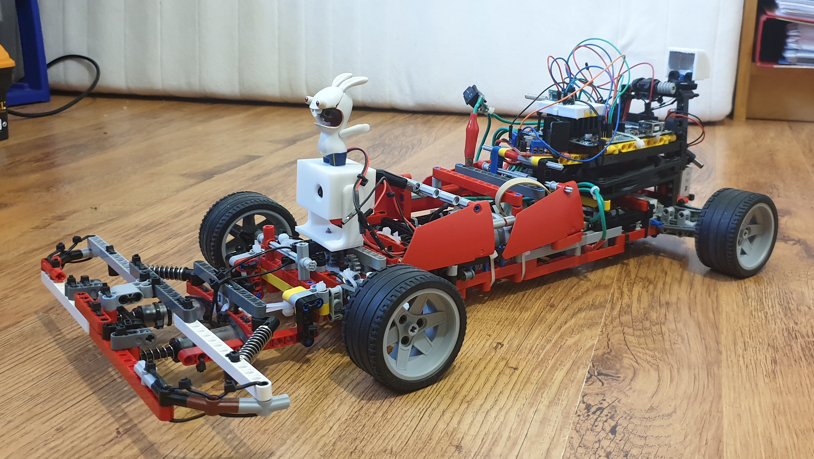
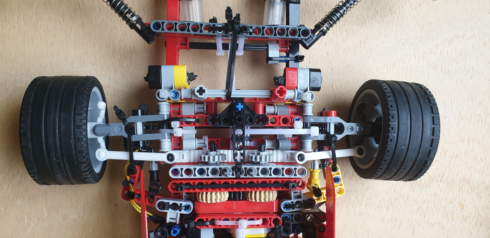
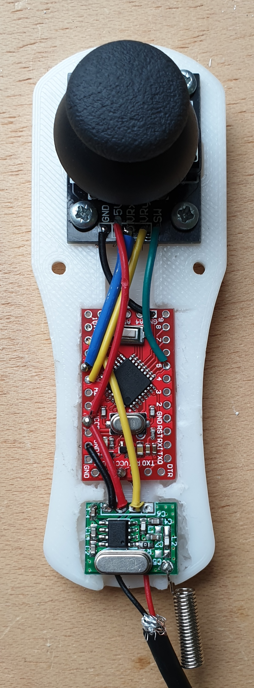

# Voiture radiocommandée LEGO

Projet de voiture radiocommandée LEGO élaboré et produit avec mon frère.

    

Voiture réalisée avec des pièces LEGO, des moteurs récupérés, une imprimante 3D pour fabriquer des pièces manquantes ou pour renforcer des zones. Et des composants électroniques pour la piloter.

## LEGO

### Transmission

Un moteur polarisé est controlé par un pont en H et est rattaché à un différentiel afin de transférer l'énergie dans les roues arrière. 

    

### Direction

Même principe que la transmission, un moteur polarisé relié au même pont en H. Une glissière relie les deux roues afin de pouvoir les tourner dans le même sens. Un bouton à gauche permet d'arréter le moteur quand les roues tournent à droite, de même avec le bouton à droite quand elles tournent à gauche. Un fils est incrusté au milieu de la glissière et un autre juste devant afin d'indiquer le centre de la direction.

    

### Stop

Un petit moteur polarisé contrôlé par un autre pont en H permettant de freiner la voiture en bloquant l'axe de la roue arrière. Très important pour éviter d'endommager la structure. La voiture pèse un certain poids. Il faut l'arrêter pour changer entre la marche avant et la marche arrière.

## Électroniques

### Voiture

Pour ce projet nous avons utilisé deux cartes Arduino.
- Une carte Arduino UNO sur la voiture pour sa fiabilité et pour les branchements. 
- Une carte Arduino Pro Mini pour sa petite taille afin de l'incorporer dans la télécommande.

Les deux cartes Arduino sont reliées avec des antennes de 433 MHz pour leurs faibles consommations et leurs portées importantes.

Deux ponts en H pour contrôler les moteurs, un pouvant transmettre jusqu'à 30 A pour la transmission et la direction et un plus petit 2A pour le frein.

Un ESP32 cam est installé pour un retour vidéo.

### Manette

    

## Run

    

